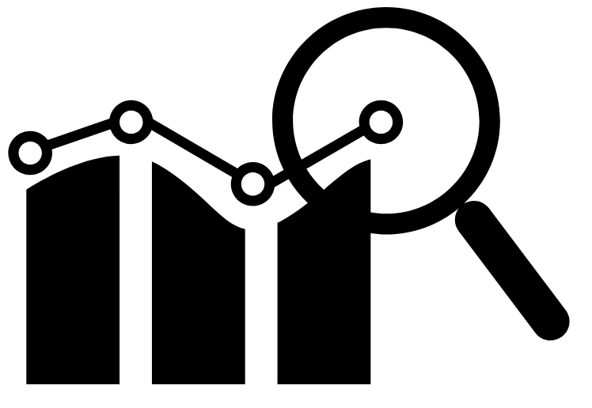

```{r setup, include=FALSE}
knitr::opts_chunk$set(echo = FALSE)
```

## Plan warszatów

1. Krótkie wprowadzenie do programowania w R (15 min)
2. Przetwarzanie danych za pomocą pakietu "dplyr" (45 min)
3. Krótka analiza danych za pomocą regresji liniowej (30 min)


Prezentację i materiały będzie można znaleźć na moim GitHubie: <https://github.com/sommermarta/lmforum>.

W razie pytań proszę o kontakt: mmartasommer@gmail.com


## Krótkie wprowadzenie do programowania w R

```{r, out.height = "250px", fig.align='center'}

```

## Wprowadzenie do R

1. Podstawowe operacje na wektorach.
2. Ramki danych.
3. Wczytywanie danych.
4. Korzystanie z pakietów.

## Przetwarzanie danych za pomocą pakietu "dplyr"

```{r, out.height = "250px", fig.align='center'}

```

## Dplyr -- podstawowe funkcje

Podstawowe funkcje:

* **select** -- wybierz kolumny
* **arrange** -- posortuj
* **filter** -- wybierz wiersze spełniające określone warunki
* **mutate** -- stwórz nową kolumnę
* **summarise** -- podsumuj (stwórz nową tabelę)
* **group_by** -- licz coś w grupach

## Operator "pipe"

Podstawowy operator:

**%>%** (pipe) -- Ctrl+Shift+M (skrót w RStudio)

## Krótka analiza danych za pomocą regresji liniowej

```{r, out.height = "250px", fig.align='center'}

```

## Dane

Zbiór danych "trees":

- girth -- obwód drzewa na poziomie piersi (w calach)
- height -- wysokość
- volume -- objętość

```{r}
data(trees)
head(trees)
```

Od czego zależy objętość drzewa?
